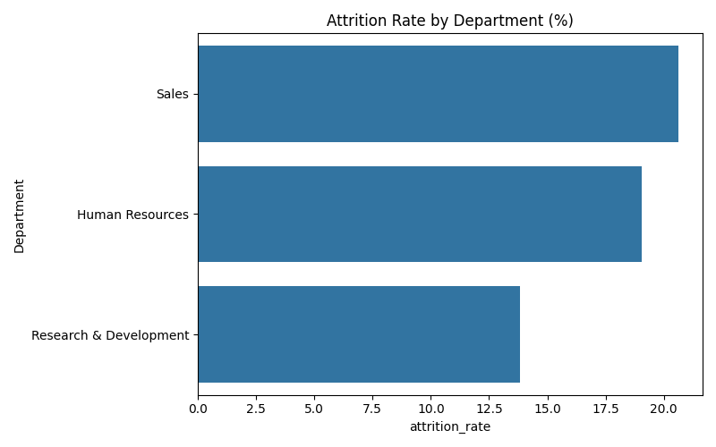
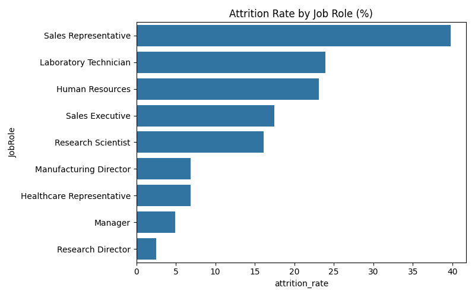
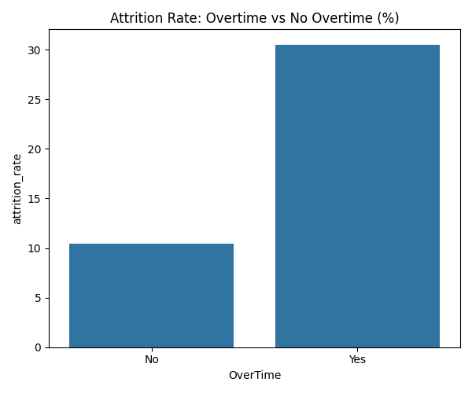

# HR Attrition Analysis

## Business Question
Which departments, job roles, and employee segments have the highest 
attrition, and what factors correlate with employees leaving?

## Tools Used
SQL (SQLite), Python, Pandas, Matplotlib, Seaborn (Google Colab)

## Key Insights
- Sales has the highest attrition among departments at 20.63%, compared to 
  19.05% in HR and only 13.84% in Research & Development.
- Sales Representatives leave at the highest rate of any job role (39.76%), 
  far above Laboratory Technicians (23.94%) and HR staff (23.08%). Managers 
  and Research Directors rarely leave (under 5%).
- Employees who work overtime have a 30.53% attrition rate, nearly three 
  times higher than employees who don't work overtime (10.44%).
- Younger employees leave far more often — under-25s have a 39.18% 
  attrition rate, dropping steadily to just 10.10% for 35-44 year-olds.
- Both Sales (20.63%) and HR (19.05%) have attrition rates above the 
  company-wide average, flagging them as priority areas for retention efforts.

## SQL Techniques Used
- GROUP BY with aggregate functions (COUNT, SUM)
- CASE WHEN for conditional counting and age bucketing
- Subquery to compare department attrition against the company-wide average

## Charts

## Dataset
IBM HR Analytics Employee Attrition Dataset (Kaggle)

## Next Steps
Investigate why Sales Representatives specifically have such high attrition 
compared to other Sales roles — could be compensation structure, workload, 
or manager-related factors worth a follow-up analysis.
